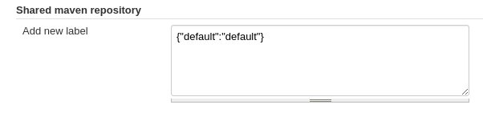
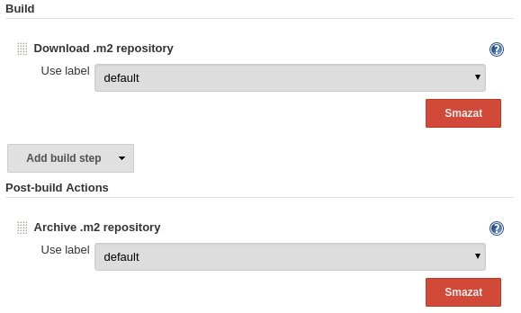
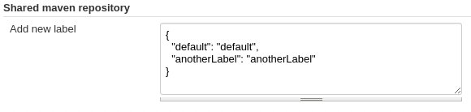
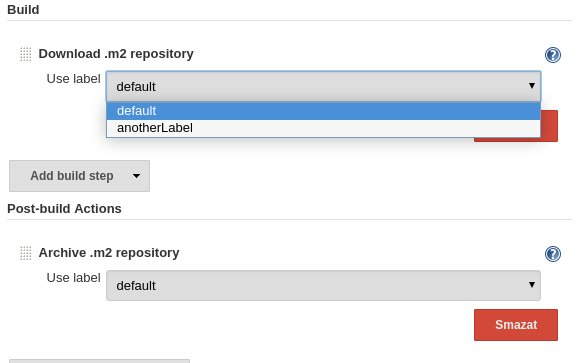
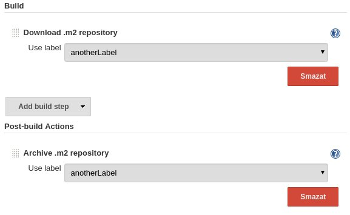

# shared-maven-repository

This plugin downloads and then (re)archives .m2 directory into jenkins root/shared-maven-repository directory after each build for jobs with specific label

### Why: 

To make installing maven dependencies faster across multiple jobs

### How:

After installation of this plugin you should see in jenkins [global configuration](http://localhost:9090/jenkins/configure) section **Shared maven repository**



In job configuration you should see new options for **Add build step** and **Add post-build action** 



To add new labels change in [global configuration](http://localhost:9090/jenkins/configure) in section **Shared maven repository** json file i manner below (no need to care about whitespace)



and apply or save.

Now in job configuration you should see new labels for **Build** and **Post-build Action** steps as below



and 


  
#### Notes:

- labels configuration is also stored in json file at location *${JENKINS_HOME}/shared-maven-repository/config.json* and its format are tuples *key-value* where *key* is ID for form inputs and should not contain special characters and *value* is label name that is shown in jobs configuration **Build** and **Post-build Action** steps,
- if multiple running jobs are trying to archive repository with same label only latest archive is used,
- if you remove label from configuration when it is still used in job its build step will not show removed label but will still use it unless changed manually and configuration is saved,
- old compressed repositories with not existing labels are not destroyed (administrator should do this manually after removing label from configuration).

## For developer installation:

```
mvn install -Danimal.sniffer.skip=true -DskipTests=true 
```

## For manual debug with UI:

```
mvnDebug clean -Djetty.port=9090 hpi:run
```

## For unit tests debug with UI:

Use custom launch configuration use Eclipse/JBDS with [these configurations](launchers/tests)

### Notes:
- For tests jenkins port is generated (http://localhost:<port>/jenkins/),
- using ```-Danimal.sniffer.skip=true``` because of errors with http://www.mojohaus.org/animal-sniffer/animal-sniffer-maven-plugin/check-mojo.html

```
[ERROR] Failed to execute goal org.codehaus.mojo:animal-sniffer-maven-plugin:1.14:check (check) on project shared-maven-repository: Execution check of goal org.codehaus.mojo:animal-sniffer-maven-plugin:1.14:check failed.: NullPointerException -> [Help 1]
org.apache.maven.lifecycle.LifecycleExecutionException: Failed to execute goal org.codehaus.mojo:animal-sniffer-maven-plugin:1.14:check (check) on project shared-maven-repository: Execution check of goal org.codehaus.mojo:animal-sniffer-maven-plugin:1.14:check failed.
```
- also there may be [this issue](https://issues.jenkins-ci.org/browse/JENKINS-30099),
- in case of errors first delete directories *./target*, *./work*, */tmp/hudson**.